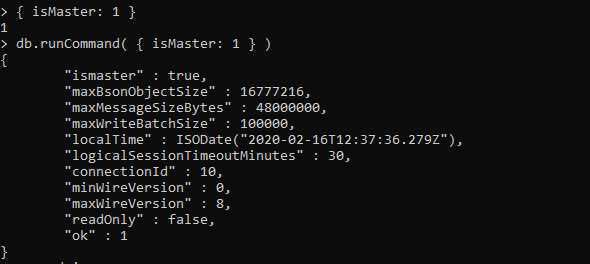
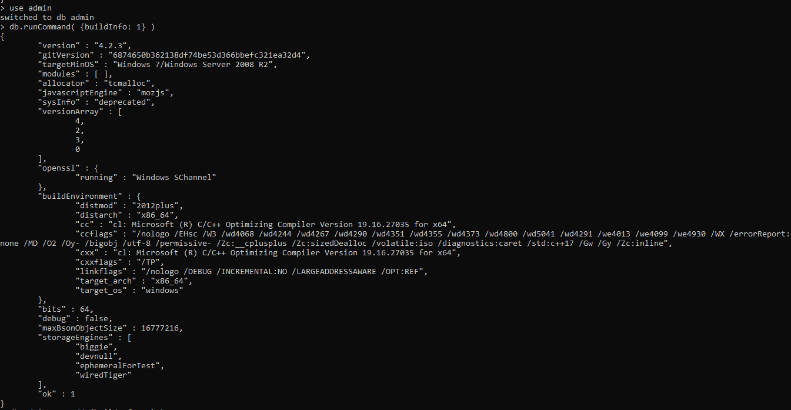
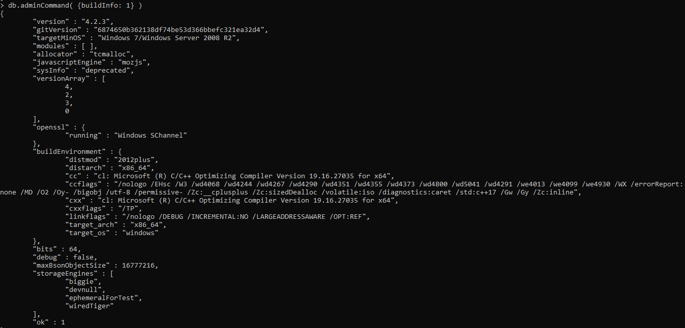
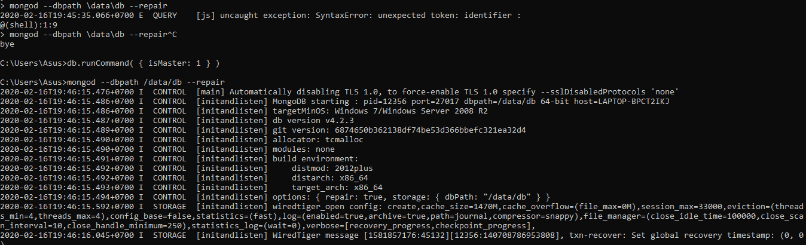
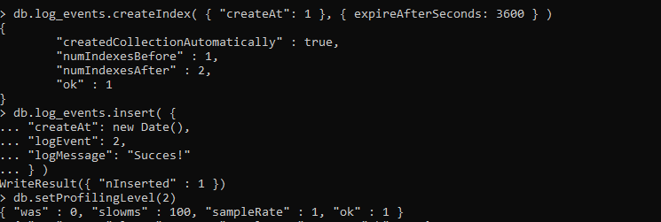
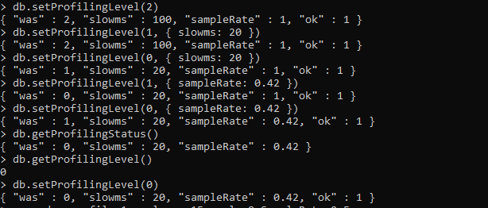
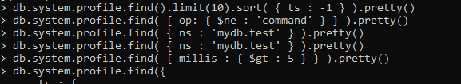
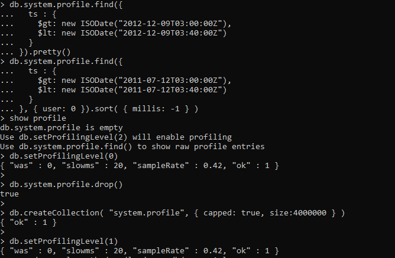

# TUGAS

** The first step is to determine the request by creating a standard BSON document, the first key is the name of the command, for example, as in the picture above, which determines an isaster request using a BSON document.

---

** The above operation displays the database structure
---

** db.adminCommand ({buildInfo: 1}) uses help that automatically runs commands in the context of the admin database.
---

** Disk-level data corruption or missing data files can prevent mongod instances from starting, and journal files may not be enough to automatically recover
---

** The above operation creates an index in the CreatedAt field of the log_events collection and sets the expireAfterSeconds value of 3600 to set the expiration time to one hour after the time specified by CreatedAt.
---

** This section uses the helper mongo shell helper db.setProfilingLevel () to enable profiling. For instructions on using the driver, see the driver documentation.
to enable profile creation for all database operations, consider the following operations in Mong Shel
---

** 
---

----