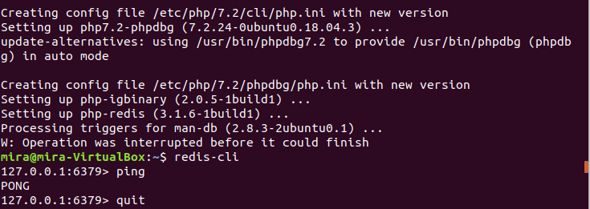
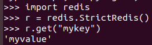
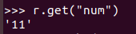
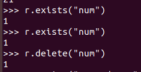
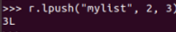

#Minggu 05

---

---

---

---

---

---

---

----

---

----

untuk mengatur nilai string pada redis yaitu menggunakan STRING.
pada gambar dibawah user akan melakukan hal sama pada shell python dengan membuat instance dari StrictRedis. dengan menampilkan "mykey" yang diset menggunakan redis-cli dari python.sementara  Output menampilkan hasil yang sama pada redis dimana python dapat berkomunikasi dengan benar dengan redis-server

----

user mengatur nilai ke redis dari python shell

---

memeriksa apakah kunci disetel dengan benar dari redis-cli

---

dpat dilihat pada output python dapat memasukkan nilai ke dalam redis dengan benar

---

menetapkan nilai integer. yang telah disediakan redis dengan iNCR dan INCRBY

---

setara dengan redis-py dari redis incr

---

menampilkan untuk memverifikasi bahwa num telah bertambah

---

mengetes dengan redis-cli untuk memastikan nilai bertambah

---

setara python dengan incrby

----

---

mengetes dengan redis-cli untuk memastikan nilai bertambah

----
Exists

---

menghapus kunci pada python

---

dengan Expire tandai key second_num kadaluwarsa setelah 10 detik

---

setara dengan menggunakan python

---

mengecek dan verifikasi list telah dibuat redis 

---

menamahkan beberapa nilai ke list

---

memeriksa daftar baru dr redis-cli

----

---

memeriksa daftar baru dari python

----

menyimpan kamus sebagai nilai. sama seperti redis docs

---

redis-py

---

memastikan telah diinput pada python dengan menguji meggunakan redis-cli

---

menampilkan menggunakan redis-py

---

Materi dan Penjelasan 4 Pada materi dan penjelasan dibagian 3 yaitu menulis program dengan python yang membutuhkan lima langkah dasar yaitu impor redis, tentukan informasi koneksi untuk redis, membuat objek koneksi redis, mengatur pesan ke redis, mengambil pesan redis dan menampilkan pesan tersebut. Pertama – tama pada shell unix python, disini user membuat dokumen baru dengan nama python3.py yang didalamnya akan berisi skrip untuk mengimplementasikan 5 langkah tersebut

---

