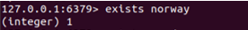

# TUGAS MINGGU 05

---

* dibawah ini merupakan contoh database pemetaan negara untuk mengatur nilai kunci dengan redis 

---

* Berikut merupakan urutan pertanyaan dalam python

---

* MSET dan MGET berfungsi untuk mengatur dan mendapatkan beberapa nilai kunci dalam suatu perintah

---

* dict.update untuk memperbarui yang digunakan pada python

---

* menggunakan integer pada python

---

* kata kunci padapython berfungsi menguji hal yg sama, rute ke dict.containts(key) 

----