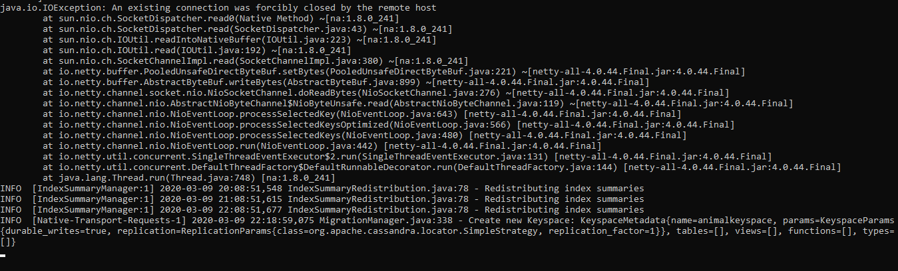

#Minggu 06

* cqlsh merupakan perintah  untuk menjalankan apache casssandra, pada gambar dibawah dapat dilihat apache cassandra dapat berjalan dan digunakan. cqlsh Ini akan membuka prompt cqlsh di mulai dengan menciptakan ruang kunci. keyspace mirip dengan skema / basis data di dunia RDBMS. 

---

---
