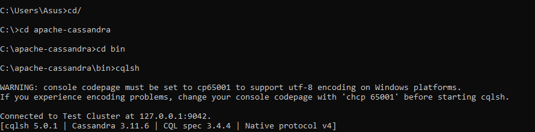
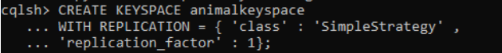
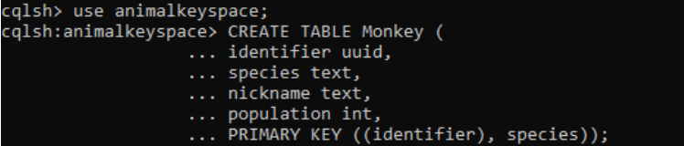
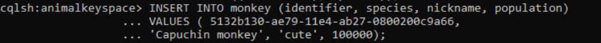
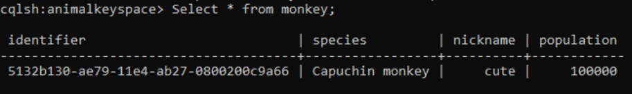
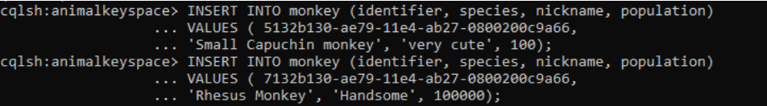
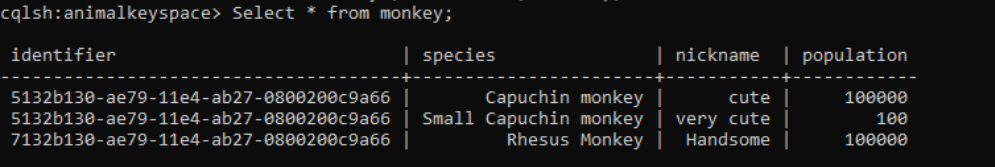

#Tugas Minggu 05

* menjalankan perintah cqsl pada apache-casssandra

---

* Pada bagian “WITH REPLICATION” dari perintah. Ini menyatakan bahwa keyspace hewan harus menggunakan strategi replikasi sederhana dan hanya akan memiliki satu replika untuk semua data yang dimasukkan ke dalam keyspace. Ini bagus untuk tujuan demonstrasi tetapi bukan pilihan praktis untuk segala jenis pengujian atau lingkungan produksi.
Selanjutnya yaitu membuat keluarga kolom. Untuk membuat keluarga kolom harus menavigasi ke ruang kunci hewan dengan bantuan "perintah USE". Perintah USE memungkinkan klien untuk terhubung ke keyspace tertentu yaitu semua perintah CQL lebih lanjut akan dieksekusi dalam konteks keyspace yang dipilih.

---

* indifier sebagai kunci partisi dan species sebagai kunci cluster.

---

* periksa apa yang terjadi sebagai hasil dari membuat dan memasukkan baris ke tabel monkey. Ini akan mengharuskan  untuk menyiram data dari memtable ke disk sehingga membuat SSTable pada disk. yang akan menggunakan utilitas bernama nodetool untuk membantu menyiram data ke disk. Untuk melakukan flush memtable navigasikan ke menu.

---

* dibawah merupakan output. perhatikan queri tentang ini untuk tujuan demonstrasi dan hampir tidak akan pernah menjalankan kueri tanpa setidaknya bagian dari kunci utama dalam predikat. 

---

* konversi data yang dimasukkan ke tabel Monkey ke JSON. Untuk melakukannya, navigasikan ke direktori $ ApacheCassandraInstallDir / bin .

---

* output dari table Monkey  yang sudah dibuat.

---
